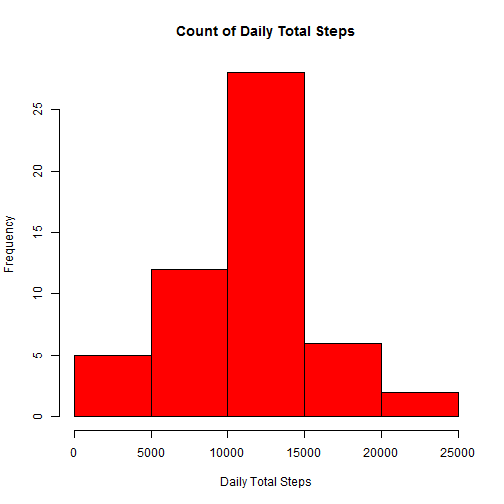
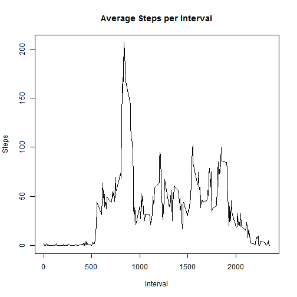
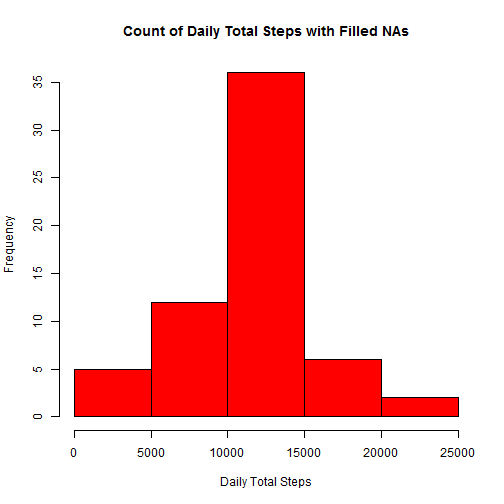
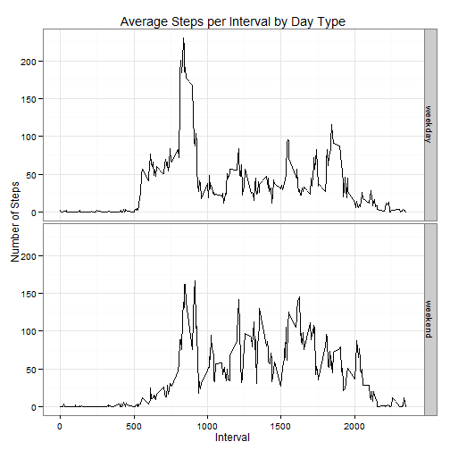

# Reproducible Research: Peer Assessment 1
by Bridget Thrasher

## Loading and preprocessing the data


```r
if (!(file.exists("activity.csv"))) {
     unzip("activity.zip")
}
dat <- read.csv("activity.csv",header=TRUE)
options(scipen=10)
```

## What is mean total number of steps taken per day?


```r
daily_total <- aggregate(steps ~ date, sum, data = dat)
hist(daily_total$steps,col="red",main="Count of Daily Total Steps",
     xlab="Daily Total Steps")
```

 

```r
daily_mean <- mean(daily_total$steps)
daily_median <- median(daily_total$steps)
```
Mean of daily steps: 10766.1887  
Median of daily steps: 10765  

## What is the average daily activity pattern?


```r
interval_mean <- aggregate(steps ~ interval, mean, data = dat)
plot(interval_mean$interval, interval_mean$steps, type="l",
     xlab="Interval", ylab="Steps", main="Average Steps per Interval")
```

 

```r
max_int <- interval_mean[which(interval_mean$steps==max(interval_mean$steps)),]
```
Interval with the maximum mean number of steps: 835  

## Imputing missing values


```r
num_na <- sum(is.na(dat$steps))
filled_dat <- dat
for (ii in 1:nrow(interval_mean)) {
     filled_dat[is.na(filled_dat$steps) & 
                     filled_dat$interval==interval_mean$interval[ii],"steps"] <- 
          interval_mean$steps[ii]
}
```
Number of missing values: 2304  
Filling missing values with interval mean value...  


```r
new_daily_total <- aggregate(steps ~ date, sum, data = filled_dat)
hist(new_daily_total$steps,col="red",main="Count of Daily Total Steps with Filled NAs",
     xlab="Daily Total Steps")
```

 

```r
new_daily_mean <- mean(daily_total$steps)
mean_diff <- new_daily_mean - daily_mean
new_daily_median <- median(daily_total$steps)
median_diff <- new_daily_median - daily_median
```
New mean of daily steps: 10766.1887  
Difference from original mean: 0  
New median of daily steps: 10765  
Difference from original median: 0  

## Are there differences in activity patterns between weekdays and weekends?


```r
day_of_week <- weekdays(as.POSIXlt(filled_dat$date))
day_of_week[day_of_week=="Saturday" | day_of_week=="Sunday"] <- "weekend"
day_of_week[day_of_week != "weekend"] <- "weekday"
day_of_week <- as.factor(day_of_week)
filled_dat <- cbind(filled_dat,day_of_week)
interval_mean <- aggregate(filled_dat$steps,by=list(filled_dat$interval,
                    filled_dat$day_of_week),FUN=mean)
colnames(interval_mean) <- c("interval","day_type","steps")
library(ggplot2)
qplot(interval, steps, data=interval_mean, facets=day_type~., geom="line",
      xlab="Interval", ylab="Number of Steps",
      main="Average Steps per Interval by Day Type") + theme_bw()
```

 


